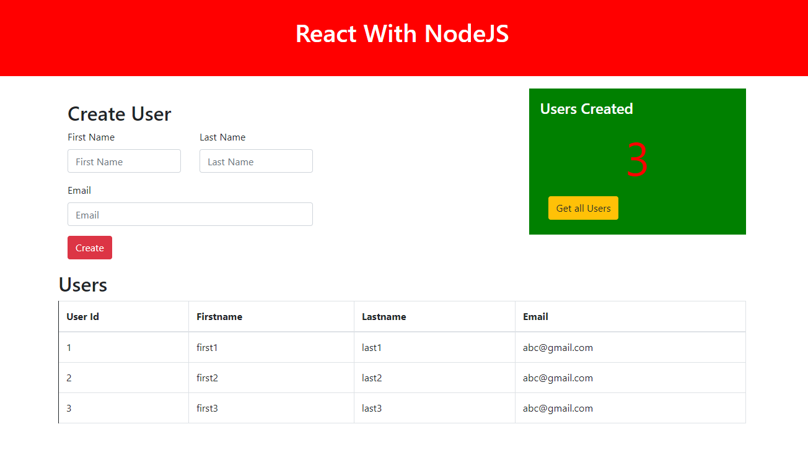

## react-nodejs-example 

### What have done in behind:
- Built and pushed image to private repo
- created EC2 instance
- Installed Docker
- Pulled image from private repo
- Started Docker container in the instance
- Configured external acces

